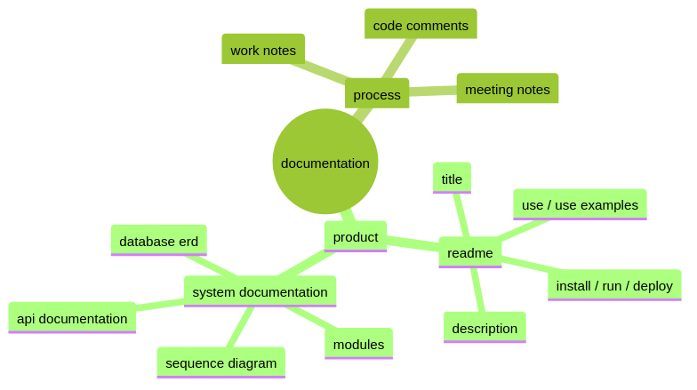

# documentation

i have a new documentation system that i'm pretty excited about and i plan to use it with my other projects too.  

basically i now have a `/docs` folder in the repo where i keep a collection of markdown files with my notes that i keep as i work.  that's the essence of my system, the rest is just icing.

my notes are compiled into an html book by a rust program called [mdBook](https://rust-lang.github.io/mdBook/) and eleventy includes this book in its build so anyone can view the site's documentation at the `/docs` route of the site.  

another feature of my documentation system is the use of a text markup language for diagrams.  i use a markup language called [mermaid](https://mermaid.js.org/).  the mermaid markup files are in a `/diagrams` folder.  i use the [mermaid cli]() and a bash script to build `.png` files in a `\images` folder from the diagram `.mmd` text files.  this is the script:

```bash
#!/bin/bash

# this script is for building .png diagrams from 
# the mermaid .mmd text files.
# the mermaid cli is installed globally via npm.
#
# this script just runs mmdc to build a .png file 
# in /images for each .mmd file in /diagrams
#
# https://github.com/mermaid-js/mermaid-cli
# npm install -g @mermaid-js/mermaid-cli
# mmdc -i input.mmd -o output.png -t forest

src_dir=$( cd "$(dirname "${BASH_SOURCE[0]}")" ; pwd -P )/src

for file in "${src_dir}"/diagrams/*.mmd
do
  basename="$(basename -- $file)"
  basename_png=${basename%.mmd}.png
  echo $( \
    mmdc \
      -i "${file}" \
      -o "${src_dir}"/images/"${basename_png}"\
      -t forest \
  )
done
```

with a plugin, it is also possible to use mermaid markup in code blocks in the markdown itself.  I considered this but decided that for my purposes it's more versatile to keep the markdown markup and the mermaid markup decoupled.

here's an example diagram!



